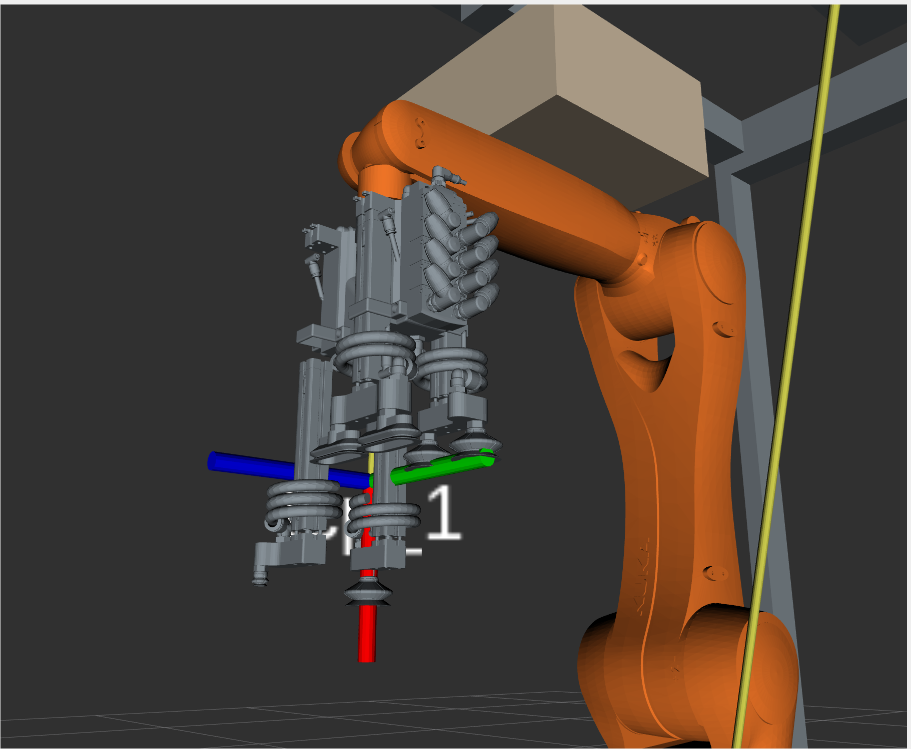

# AIP_Bosch_Gripper

The aip_bosch_gripper part includes the necessary drivers, service definitions, URDF, config and launch files for the Bosch gripper to be used in the AIP application.

## Gripper.cpp

### Mapping from cylinder id to the hardware pins
To enable an operation mode with different modes, the .cpp file contains a mapping from the cylinder_id to the corresponding hardware pins. This is based on the mapping as declared in the [IO Mapping KUKA](https://github.com/IRAS-HKA/aip_wiki/blob/main/docs/mapping_hw_to_io_number.md). Equivalent to this, the Work Visual is configured. You can also review the numbers on the KUKA SmartPad (HMI).

``` 
cylinder_pins = {
    {1, {40, 39, 132, 134, 33}},
    {2, {42, 41, 136, 138, 34}},
    {3, {44, 43, 133, 135, 35}},
    {4, {46, 45, 137, 139, 36}}
};
```

### execute_command
This method contains the logic, to send the previously formed command to the robot control. Therefore, the IO pin type is set to 2 (Write-Mode).

After the initialization of the variables, the service sends out the information to the KUKA control in a while-loop. The break condition of the loop (= command_received) is to set to True, once the information was transfered. The eki_read_state-method delivers the information, whether the pin state was set successfully or not.

### check_command
This method contains the logic to check the command state of the pins. Therefore, the IO pin type is set to 1 (READ-Mode).

Just like in the execute_command method, there is a control mechanism in place, which checks if the request to the KUKA control was actually made. Once again, the eki_write_commands checks for the pin states in a while-loop. Only when the information was received and the pins have the desired state, the while loop ends. However, there is a possibility to exit it by pressing CTRL+ C on the keyboard.

### open_gripper
This method contains the logic to open the gripper. First of all, the following pins are being set:

- eject_pins
- eject_check_pins
- suction_pins
- retract_pins
- retract_check_pins

MoveGripper requests parameter from the method-head (variable name "request"), contains the necessary pins to perform the desired movement of the gripper. Those integers are being pushed into the previously mentioned arrays. For every array, the pins are being printed to the terminal and the command will be executed by calling the method "execute_command". If for example the gripper has to retract, the pins for the previous extension have to be set to False and the pins for retraction have to be set to True. Thats why the boolean True or False is passed to the execute_commands method, depending on the wanted behavior of the gripper.

In the for-loops there are check_commands and timeouts implemented in order to make sure the pins are physically extended before the next order is sent out. Otherwise, this could result in a malfunction of the gripper, if e.g. the gripper starts the suction before it is fully extended.

### close_gripper
This method contains the logic to close the gripper. The structure is analog the open_gripper methode, however the procedure is inverted.

Consequently, the suction is turned off after the cylinder has been ejected. To complete the cycle, the cylinder is retracted again.


## Gripper Visualization (Rviz)
The `GripperVisualizerNode`is a simple node which provides services to visualize the opening and closing of the grippers. When the open or close services are called, the Node will publish the corresponding gripper state to the `/gripper_controller/commands` topic. Each of the four cylinders can be actuated individually within Rviz and the extension can also be specified.

It is essential to specify the gripper configuration within the `ros2_controllers.yaml`file in `aip_cell_description`package for this to work correctly. The following configuration is an example of how to configure the aip bosch gripper:

```yaml
gripper_controller:
  ros__parameters:
    joints:
      - joint_cylinder_back_left
      - joint_cylinder_back_right
      - joint_cylinder_front_left
      - joint_cylinder_front_right
    interface_name: position
```

The node offers two services – `/viz_open_gripper` and `/viz_close_gripper`. The services are called with the following service type:

```
MoveCylinders cylinders
---
bool result
```
with the following definition of the `MoveCylinders` message:

```
int32[] cylinder_ids
float32[] extensions
```
Currently, both services are defined identically, however the implementation can be extended to include additional gripper movements or also the attachment or detachment of collision objects to the corresponding grippers. 



### Starting the Gripper Visualization Node
To start the gripper visualization node, the following command can be used:

```bash
ros2 launch aip_bosch_gripper aip_bosch_gripper_node.launch.py only_visualize:=<true|false>
```
If `only_visualize` is set to `true`, the node will only visualize the gripper movement in Rviz. If set to `false`, the gripper on the real robot will also be actuated.